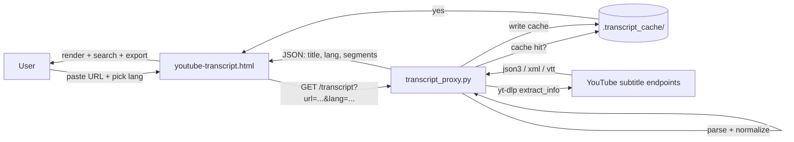
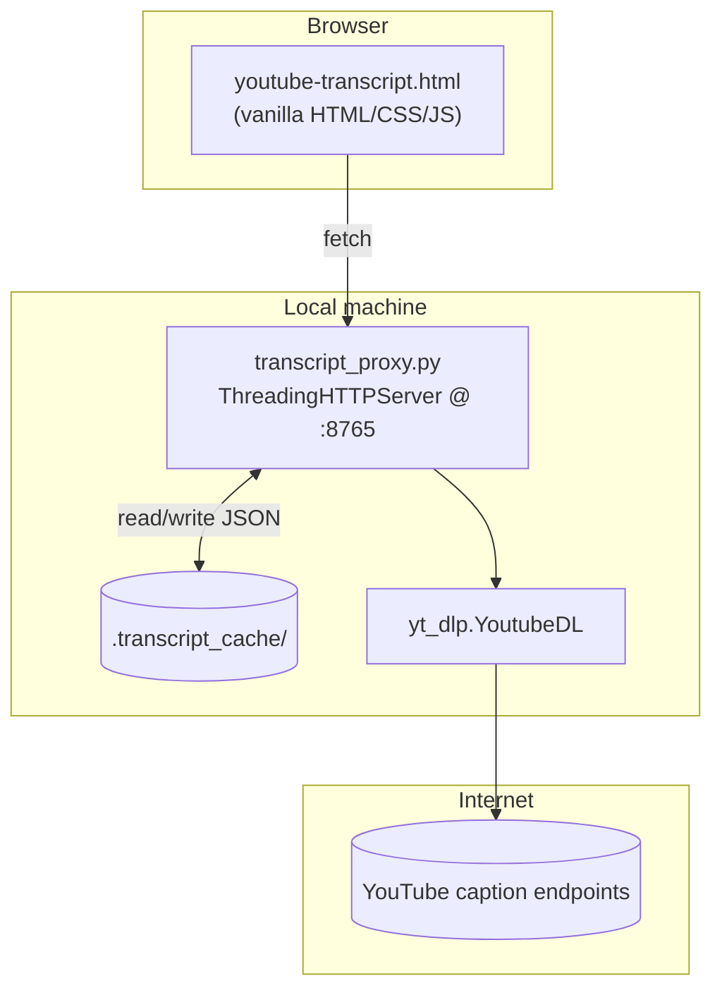

<div align="center">

# 🎬 TranscriptAI

### YouTube → Text. Clean, searchable transcripts in seconds. No signup. No limits.

A single-page web app that takes any YouTube URL and pulls a clean, time-stamped transcript in your chosen language — with search, copy, TXT and SRT export. Powered by a tiny local Python proxy that uses `yt-dlp` to fetch official and auto-generated captions, with on-disk caching so repeated lookups are instant.

[](#-license)
[](https://www.python.org)
[](https://github.com/yt-dlp/yt-dlp)
[](#)


</div>

---

## 🎬 Demo

> 📸 **Screenshot / GIF placeholders** — replace with real captures:
> - `./docs/demo-extract.gif` — paste URL → transcript appears
> - `./docs/demo-search.gif` — searching inside the transcript
> - `./docs/demo-export.gif` — downloading TXT and SRT

> 🌐 **Run locally:** `python transcript_proxy.py` → open <http://127.0.0.1:8765>

**Example response** from `GET /transcript?url=https://www.youtube.com/watch?v=XXXXXXXXXXX&lang=en`:

```json
{
  "title": "Operating Systems — Lecture 4",
  "lang": "en",
  "segments": [
    { "start": 0.00,  "dur": 4.20, "text": "Welcome back, today we continue with processes." },
    { "start": 4.20,  "dur": 3.80, "text": "The OS maintains a process table..." },
    { "start": 8.00,  "dur": 5.10, "text": "Every entry is called a process control block." }
  ]
}
```

---

## 📑 Table of Contents
- [Features](#-features)
- [How it works](#-how-it-works)
- [Architecture](#-architecture)
- [Tech Stack](#-tech-stack)
- [Project Structure](#-project-structure)
- [Getting Started](#-getting-started)
- [API Reference](#-api-reference)
- [Frontend UX](#-frontend-ux)
- [Caching](#-caching)
- [Configuration](#-configuration)
- [Deployment Notes](#-deployment-notes)
- [Roadmap](#-roadmap)
- [Contributing](#-contributing)
- [License](#-license)

---

## ✨ Features

| | Feature | What it does | Why it matters |
|--|----------|----------------|-----------------|
| ⚡ | **One-click extraction** | Paste a YouTube URL, hit **EXTRACT**, get the full transcript. | Zero friction — no API key, no signup, no quota. |
| 🌍 | **13 caption languages** | English, Hindi, Hinglish, Spanish, French, German, Japanese, Korean, Portuguese, Russian, Chinese, Arabic, plus *Original*. | One tool for content in your native language *and* whatever you're studying. |
| ⏱️ | **Two view modes** | Toggle between time-stamped (SRT-style) and clean plain text. | Quote with timestamps when you need to, or paste prose when you don't. |
| 🔍 | **In-transcript search** | Live filter with match count, right inside the result panel. | Find the moment a topic was mentioned without scrubbing the video. |
| 📋 | **Copy + download (TXT / SRT)** | One-tap copy, plus downloadable `.txt` and `.srt` files. | Drop straight into subtitling software, blogs, or notes. |
| 📊 | **Live stats bar** | Word count, character count, segment count update with every fetch. | Quick sanity check before exporting. |
| 🧠 | **Smart language fallback** | If `en` isn't available, falls back to `en-IN`, then any `en-*`, then base language. Picks the best track from manual + auto-generated subtitles. | You almost never get "no captions" when something *does* exist. |
| 💾 | **On-disk caching** | Successful fetches saved to `.transcript_cache/` keyed by `videoId__lang.json`. | Second lookup of the same video is near-instant and avoids rate limits. |
| 🛡️ | **Graceful 429 handling** | Detects "Too Many Requests" from YouTube and returns a clean error. | The UI shows a real message instead of a stack trace. |
| 🔓 | **Three caption formats parsed** | `json3`, classic `xml`, and `vtt` — all handled. | Works across the various caption payloads YouTube actually serves. |
| 🖼️ | **Polished, dark-themed UI** | Custom typography (Bebas Neue, DM Mono, DM Sans), noise texture, accent system, full brand identity (`files/00-preview-all.svg`). | Looks like a product, not a CS-101 demo. |
| 🔒 | **Privacy first** | No accounts, no analytics, transcripts never leave your machine unless you export them. | Built for users who want a tool, not a funnel. |

> ⚠️ **Honest scope note:** Translation/summarization, speaker-diarization and audio-based transcription (Whisper, etc.) are **not** implemented. TranscriptAI surfaces YouTube's existing captions — it doesn't transcribe audio from scratch.

---

## 🧭 How it works



1. The browser hits the local proxy at `/transcript?url=...&lang=...`.
2. The proxy checks `.transcript_cache/<videoId>__<lang>.json`.
3. On miss, it uses `yt-dlp` to enumerate `subtitles` and `automatic_captions`, picks the best match for the requested language (with sensible fallbacks), and downloads the caption file.
4. The payload is parsed (`json3`, `xml`, or `vtt`) into a normalized `{start, dur, text}[]` array.
5. The result is cached and returned as JSON.
6. The frontend renders it with timestamps, search, and TXT/SRT export.

---

## 🏗️ Architecture



### Folder Layout

```
TranscriptAI/
├── transcript_proxy.py        # Tiny stdlib HTTP server + yt-dlp glue
├── youtube-transcript.html    # The entire UI in one file
├── transcript1.txt            # Sample transcript (served at /transcript1.txt)
├── files/
│   └── 00-preview-all.svg     # Brand identity sheet (logo variants)
└── .transcript_cache/         # Created on first run (gitignored)
```

---

## 🧰 Tech Stack

- **Backend:** Python 3 standard library (`http.server.ThreadingHTTPServer`) + [`yt-dlp`](https://github.com/yt-dlp/yt-dlp)
- **Frontend:** Vanilla HTML/CSS/JS — no framework, no build step
- **Caching:** Plain JSON files on disk
- **Fonts:** Bebas Neue, DM Mono, DM Sans (loaded from Google Fonts)

---

## 🚀 Getting Started

### Prerequisites
- Python **3.10+**
- A reasonably recent `yt-dlp` (it talks to live YouTube endpoints, so keep it updated)

### Install

```bash
git clone https://github.com/<your-username>/TranscriptAI.git
cd TranscriptAI
pip install -U yt-dlp
```

### Run

```bash
python transcript_proxy.py
# → Transcript proxy listening on http://127.0.0.1:8765
```

Then open <http://127.0.0.1:8765> in your browser. The proxy serves `youtube-transcript.html` at `/`, so you do not need any extra static server.

### CLI flags

```bash
python transcript_proxy.py --host 0.0.0.0 --port 9000
```

| Flag | Default | Notes |
|------|---------|-------|
| `--host` | `127.0.0.1` | Use `0.0.0.0` to expose on your LAN. |
| `--port` | `8765` | Any free port. |

---

## 📡 API Reference

CORS is wide-open (`Access-Control-Allow-Origin: *`), so the same proxy works from any local frontend.

### `GET /transcript`
Fetch (or cache-hit) a transcript.

**Query params**

| Param | Required | Example | Notes |
|-------|----------|---------|-------|
| `url` | ✅ | `https://www.youtube.com/watch?v=XXXXXXXXXXX` | Standard `youtube.com` or `youtu.be` links accepted. |
| `lang` | ❌ (default `en`) | `hi`, `es`, `original`, `hinglish` | `original` / `hinglish` use the first cached track if available. |

**Responses**

- `200 OK` — `{ title, lang, segments: [{start, dur, text}, ...] }`
- `400` — missing `url`
- `404` — endpoint not found
- `429` — YouTube rate-limited the proxy; wait and retry
- `500` — anything else

### `GET /health`
Returns `{ "ok": true }`. Use it as a liveness probe.

### `GET /` and `GET /youtube-transcript.html`
Serves the single-page UI.

### `GET /transcript1.txt`
Serves the bundled sample transcript file.

### Caption-format support

| Format | Where it comes from | Parser |
|--------|---------------------|--------|
| `json3` | YouTube's modern JSON caption payload | `parse_json3` |
| `xml` (classic) | Legacy `start="..." dur="..."` and the compact `t="..." d="..."` variants | `parse_xml` |
| `vtt` | WebVTT subtitle files | `parse_vtt` |

---

## 🎨 Frontend UX

The HTML file is a self-contained design system:

- **Input bar** with language selector and Timestamps / Plain Text toggle
- **Status bar** with spinner while fetching
- **Result panel** with:
  - Live word / character / segment counts
  - In-result search with match count
  - Copy All, Download TXT, Download SRT actions
  - SRT-style toolbar (`TRANSCRIPT.SRT` / `TRANSCRIPT.TXT` label)
- **"How it works"** explainer section (Paste → Fetch → Read → Privacy)

A full brand-identity sheet lives at `files/00-preview-all.svg` (primary logo, navbar dark/light, icon, favicon, stacked, social DP, poster/banner, dark/light mode lockups, transparent overlay, email-doc lockup).

---

## 💾 Caching

The proxy writes one file per `(videoId, lang)` pair into `.transcript_cache/`:

```
.transcript_cache/
├── dQw4w9WgXcQ__en.json
├── dQw4w9WgXcQ__hi.json
└── ...
```

To clear the cache, just delete the folder — it'll be recreated automatically on the next request. Add `.transcript_cache/` to your `.gitignore` (it shouldn't be committed).

---

## ⚙️ Configuration

There's no `.env` file — the only knobs are the CLI flags above. If you want a hosted setup, see the next section.

---

## 🚢 Deployment Notes

This project is designed to **run locally**. A few honest caveats before you put it on a public URL:

- 🚧 **YouTube rate limits:** A public deployment will hit IP-based throttling much faster than a local one. The proxy already detects 429s, but a public site needs a queue and probably proxied/rotated egress.
- 🚧 **`yt-dlp` is a moving target:** YouTube's caption endpoints change. Pin a version, run a smoke test in CI, and update regularly.
- 🚧 **No auth:** The proxy is wide-open. If you expose it, put it behind a reverse proxy (Caddy / nginx) with rate limiting and probably basic auth.
- 🚧 **Single-process server:** `ThreadingHTTPServer` is fine for personal use, not a production load. For real traffic, wrap the logic in FastAPI/Flask and serve it with `uvicorn`/`gunicorn`.

> ℹ️ Beyond running `python transcript_proxy.py` locally, I did not find any deployment scripts, Dockerfile, or CI in the repo. [High confidence]

---

## 🗺️ Roadmap

Ideas that would fit the current shape of the project:
- [ ] Optional Whisper fallback for videos with **no** captions at all
- [ ] AI-powered summary / chapter detection (via your own API key)
- [ ] Dockerfile + minimal deployment guide
- [ ] Pin `yt-dlp` and add a nightly health-check script
- [ ] Dark/light theme toggle on the UI
- [ ] Browser extension that streams the active tab's video into the proxy

---

## 🤝 Contributing

1. Fork and create a feature branch.
2. If you change the parser, please add a snippet of a real (anonymized) caption payload it had trouble with — it makes regressions easy to spot.
3. Open a PR with a clear before/after for any UI change.

---

## 📜 License

I did not find a `LICENSE` file in the repo. **MIT** is a sensible default for a tool like this — drop a `LICENSE` file in the root before publishing, or update this section to match your choice. [Low confidence — verify before publishing]

---

<div align="center">

Made for students, researchers, and anyone who'd rather read a video than watch it. 📖

</div>
